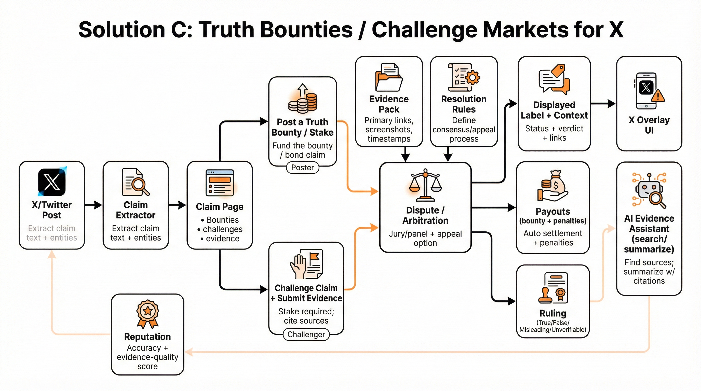

# Solution C: Truth Bounties / Challenge Markets for X

## TL;DR

Instead of a continuous prediction market, use a simpler “challenge” model:

- Someone posts a **truth bounty** (a reward) on a claim.
- A challenger can put up a stake and submit evidence.
- A neutral dispute process decides whether the claim is true/false/misleading/unverifiable.
- The winner gets paid; the loser loses stake.

This is less “stock market” and more “bounty + arbitration,” which can be easier for users to understand and can focus attention on the claims that actually matter.

## End-to-end overview

1. A post contains a claim.
2. The system creates a claim page.
3. Any user can:
   - post a **truth bounty** (reward for finding the truth), and/or
   - **challenge** the claim by staking and submitting evidence.
4. The claim goes through a dispute process.
5. Outcome is published on the tweet overlay.
6. Payouts and reputation changes happen automatically.

## Core mechanism (how truth is determined)

The key design choice is the dispute process:

- **Lightweight default:** clear resolution sources where possible.
- **When judgment is needed:** a small panel/jury makes a decision using explicit rules.
- An appeal path exists, but is costly (to prevent endless re-litigation).

This aligns with the idea that credibility depends on transparent procedures, not on “who you trust.” (See https://balajis.com/p/credible-neutrality.)

## Incentives (discourage herding; reward contrarians; penalize wrong claims/challenges)

### How minority-correct challengers are rewarded more

If a claim is widely believed, a challenger who proves it false can win a large bounty (and/or a large reputational gain). Bounties can be funded by:
- the original poster (bonding their claim)
- readers who want clarity
- third parties (media, NGOs, researchers)

### How wrong predictions are penalized

- If you challenge a true claim, you lose your stake.
- If you post a false claim with a bond, you lose your bond.

### How to avoid turning into a comment thread / popularity contest

- Challenges require **skin in the game** (stake).
- Evidence must be presented in a structured way (links, primary sources).
- The outcome comes from the dispute process, not from upvotes.

### Worked example (majority vs minority)

Claim: “Public figure P said statement S yesterday.”

- The poster bonds the claim with **$100** (optional design choice).
- A reader adds a **$200 truth bounty** (“pay whoever can prove this claim false”).
- Most people assume it’s true.
- A minority challenger stakes **$50** and submits a full evidence pack showing the quote is fabricated.
- The dispute process rules **False**.

Payout example:
- Challenger wins the **$200 bounty** + gets the poster’s **$100 bond** (minus fees).
- Poster loses the bond.
- If the challenger had been wrong, they would lose the **$50 stake**.

Reputation example:
- Challenger’s “accuracy” and “evidence quality” scores increase.
- Poster’s trust score decreases.

## Resolution & verification

This model is only as good as the dispute system.

Practical design options:

- **Panel of vetted jurors** selected from high-accuracy contributors.
- **Random juries** with eligibility + anti-sybil protections.
- **Tiered courts**: small jury → larger appeal jury if someone pays an appeal cost.

Community Notes already uses eligibility criteria, reputation, and anti-harassment measures like aliases (see https://communitynotes.x.com/guide/). Those ideas transfer naturally to dispute participants.

## Manipulation resistance

Risks:
- coordinated brigading against juries
- harassment of challengers
- spamming low-quality challenges

Mitigations:
- aliases / privacy for participants (Community Notes approach)
- escalating costs for repeated failed challenges
- rate limits + moderation of obviously abusive claims
- monitoring for coordinated activity (optional “watchtowers”; see `prompts/extra.md`)

## What a user would see (examples)

### Reader view
- “Status: **Challenged** · Current outcome: **Pending** · Bounty: **$300**”
- After resolution: “Outcome: **False** · Evidence: 3 primary links · Who earned payout: Challenger (alias)”

### Challenger view
- “Start a challenge” → stake amount → upload/attach evidence links → submit

## MVP plan (6–10 weeks)
- claim pages + manual challenges
- simple web UI + overlay
- bounty posting + staking (start with play-money credits if needed)
- jury workflow + explicit resolution rules + appeals
- AI assistant to help collect/summarize evidence (careful: it must cite sources)
- abuse protection + participant privacy features

## 1–3 year roadmap

- richer dispute system (more scalable juries)
- better AI evidence tooling + verification
- optional integration with markets for “fast probability” signals

## Open questions for future R&D

- How do we ensure the dispute system stays credibly neutral at scale?
- How do we prevent bounty-funded harassment (targeting individuals with “prove X wrong” bounties)?

## References

- [X, “Community Notes Guide”](https://communitynotes.x.com/guide/)
- [Balaji Srinivasan, “Credible Neutrality As A Guiding Principle”](https://balajis.com/p/credible-neutrality)
- [Vitalik Buterin, “From prediction markets to info finance”](https://vitalik.eth.limo/general/2024/11/09/infofinance.html)
- [Yonathan A. Arbel & Michael D. Gilbert, “Truth Bounties: A Market Solution to Fake News”](https://scholarship.law.unc.edu/cgi/viewcontent.cgi?article=6960&context=nclr)
- [Robin Hanson, “News Error Markets”](https://www.overcomingbias.com/p/news-error-markets)
