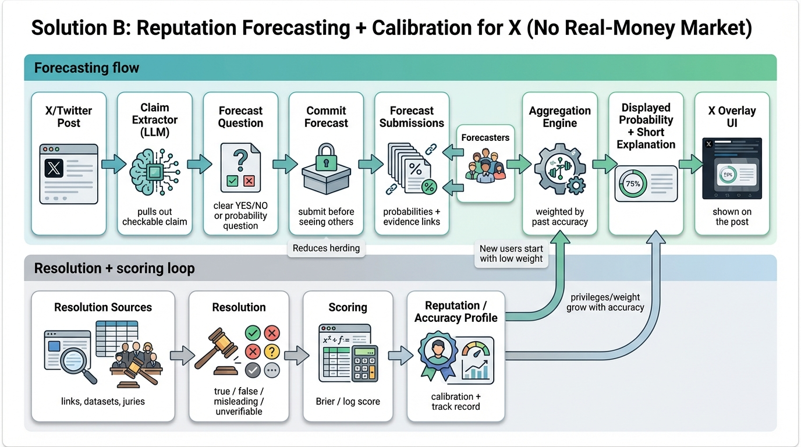

# Solution B: Reputation Forecasting + Calibration (No Real-Money Market)

## TL;DR

Instead of a tradable market, run a **forecasting system**: people submit probabilities, the system later resolves the claim, and it updates each forecaster’s public accuracy profile. The displayed probability is a weighted average that gives more weight to people who have been accurate in the past.

This keeps the “predict → resolve → tally” loop (see https://nunosempere.com/blog/2023/08/19/keep-track-of-accuracy-on-twitter/) while reducing regulatory risk and making participation feel more like “forecasting” than “betting”.

## End-to-end overview

1. A post contains a checkable claim.
2. An AI assistant extracts the claim and creates a short forecasting question.
3. Forecasters submit a probability (e.g., 30% true) and optionally attach evidence links.
4. The system aggregates forecasts into a displayed probability.
5. At a resolution time (or when evidence becomes clear), the claim is resolved.
6. Forecasters are scored; their accuracy profile updates.

## Core mechanism (how it produces a probability)

- The displayed probability is an average of forecasts.
- The twist is **accuracy weighting**: forecasters with a better track record influence the aggregate more.
- This mirrors Community Notes’ idea of “helpfulness” reputation (see https://communitynotes.x.com/guide/) but applied to truth forecasting.

## Incentives (discourage herding; reward contrarians; penalize wrong forecasts)

In this design, incentives are primarily:
- reputation and visibility (accuracy profile, leaderboard)
- access/privileges (e.g., ability to forecast more claims, higher weight)
- optional rewards (cash prizes / grants) *without tying every claim to direct wagering*

### How minority-correct forecasters are rewarded more

Use a **proper scoring rule** (a standard way to score probabilities). In plain terms: you get a much higher score when you confidently call something correctly that others got wrong.

### How wrong predictions are penalized

Wrong (overconfident) forecasts receive worse scores and reduce the forecaster’s accuracy reputation.

### How to avoid turning into a comment thread / popularity contest

- Separate “forecast” from “debate”. Forecasts are numbers, not likes.
- Require evidence links for strong claims.
- Hide social signals like follower count.
- Weight by accuracy, not popularity.

### Anti-herding UX

To reduce information cascades (see `Collective Stupidity — How Can We Avoid It? Sabine Hossenfelder` https://www.youtube.com/watch?v=25kqobiv4ng):

- **Hide others’ forecasts until you submit your own** (“commit first, then reveal”).
- Optionally, run “blind rounds” where only the final aggregate is shown.

### Worked example (majority vs minority)

Claim resolves to **False**.

- 100 forecasters predict **80% True** (p=0.8).
- 5 forecasters predict **20% True** (p=0.2) and share evidence links.

Using a simple Brier score (lower is better): `(p − outcome)^2` with outcome = 0.

- Majority score: `(0.8 − 0)^2 = 0.64` (bad)
- Minority score: `(0.2 − 0)^2 = 0.04` (good)

Reputation update example:
- Convert to points: `points = 100 × (1 − Brier)`.
- Majority earns `36` points; minority earns `96` points.

Over time, those contrarian-but-correct forecasters gain much higher weight, making the system resistant to “popular but wrong” dynamics.

## Resolution & verification

This approach stands or falls on resolution quality.

Borrowing from “predict → resolve → tally” (see https://nunosempere.com/blog/2023/08/19/keep-track-of-accuracy-on-twitter/):

- Prefer claims that can be resolved using clear sources.
- Use a tiered approach:
  1. automatic resolution for easy cases (official datasets)
  2. human panel/jury for hard cases
  3. appeal path for disputed outcomes

As a practical rule: if a claim cannot be resolved cleanly, mark it **Unverifiable** and score forecasts accordingly.

## Manipulation resistance

Key risks:
- brigading and coordinated forecasting
- sybil accounts inflating “consensus”

Mitigations inspired by Community Notes:
- eligibility criteria and gradual onboarding
- reputation weighting (new users start with low influence)
- monitoring for suspicious coordination

(See https://communitynotes.x.com/guide/.)

## Governance & credible neutrality

To keep the system legitimate across different viewpoints:

- keep rules simple, public, and stable
- minimize discretionary moderation
- make resolution criteria explicit

(See https://balajis.com/p/credible-neutrality.)

## What a user would see (examples)

### Reader view
- “Truth signal: **35% likely true** · Label: **Unclear**”
- “Why: 3 evidence links + 2-line summary”
- “How this is computed: weighted by historical accuracy”

### Forecaster view
- “Submit your probability (0–100%)”
- “Add 0–3 evidence links”
- “You must submit before seeing others’ forecasts”

## Open questions for future R&D

- How do we prevent “team sports” forecasting (people using forecasts as identity signals)?
- How do we handle fast-moving breaking news without overconfident early labeling?

## References

- [Nuno Sempere, “Incorporate keeping track of accuracy into X (previously Twitter)”](https://nunosempere.com/blog/2023/08/19/keep-track-of-accuracy-on-twitter/)
- [X, “Community Notes Guide”](https://communitynotes.x.com/guide/)
- [Balaji Srinivasan, “Credible Neutrality As A Guiding Principle”](https://balajis.com/p/credible-neutrality)
- [Sabine Hossenfelder, “Collective Stupidity — How Can We Avoid It?” (YouTube)](https://www.youtube.com/watch?v=25kqobiv4ng)
- [Vitalik Buterin, “From prediction markets to info finance”](https://vitalik.eth.limo/general/2024/11/09/infofinance.html)
